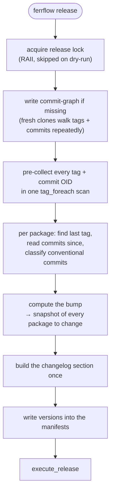
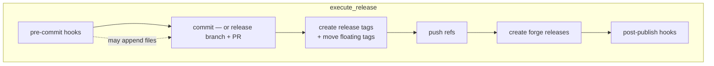
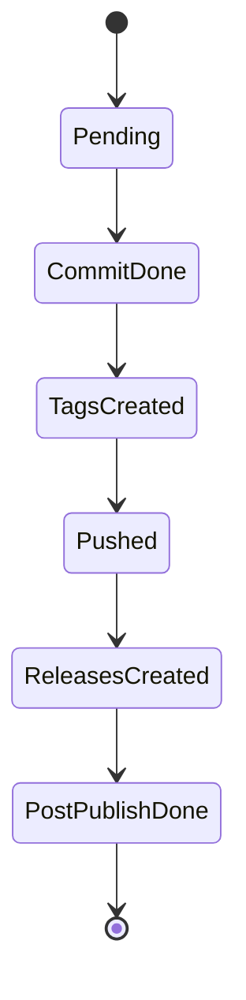
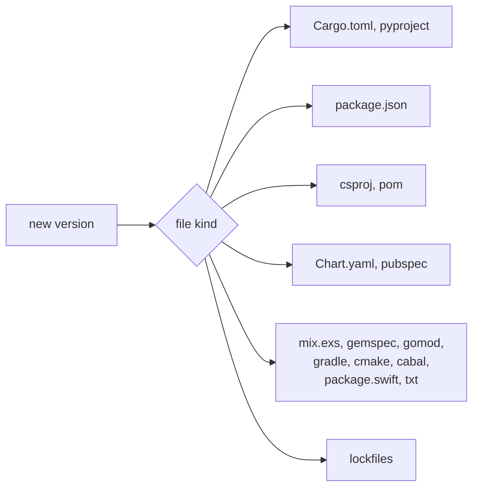

# The release algorithm

What `ferrflow` does between "read the commits" and "the release exists". The ordering here is not
arbitrary — several steps are sequenced specifically so a crash or a failure leaves the repository
in a state you can resume from rather than repair by hand.

## Overall shape

The tag pre-collection matters more than it looks: without it, every package does its own tag walk,
and lookups go from `O(1)` against a prepared map to `O(tags)` callbacks plus an `O(commits)` walk —
per package. On a monorepo with many tags that is the difference between seconds and minutes.

The changelog section is built **once** and reused: hooks receive it (`ctx.changelog` /
`FERRFLOW_CHANGELOG`) and the tag body uses the same text, so the release notes, the tag annotation
and the hook input cannot disagree.

## Execution, and why the order is what it is

**Git lands before the forge.** Creating a GitHub release for a tag that was never pushed produces a
release pointing at a ref nobody else can resolve. Pushing first means the worst case is a pushed
tag with no release yet — recoverable, and visible.

**`files_to_commit` is snapshotted after the pre-commit hooks run**, because a hook may generate
files (a lockfile, a formatted manifest) that belong in the release commit.

**PR mode uses one stable branch per target** (`ferrflow/<target>`), so repeated runs reuse the same
pull request instead of opening a new one each time. The branch is force-pushed — rebuilt from the
fresh release commit — but the code refuses to clobber commits a human pushed onto it.

## Crash resume

A release is a sequence of irreversible side effects. The checkpoint records how far it got.

Written to `.git/ferrflow.checkpoint.json`, pinned to the HEAD it was created against.

- Resuming skips every phase already marked done — it will not double-tag or double-publish.
- A checkpoint pinned to a **different commit** means the repository moved since the interrupted
  run. That is treated as stale and refused rather than resumed, because silently continuing would
  apply half a release to the wrong tree.
- Dry-run records nothing.

## Writing versions into manifests

18 modules under `src/formats/`, each owning one file shape and each carrying its own tests. A
format writer edits **in place** rather than reserialising — reformatting a user's manifest is a
bug, not a side effect, so the writers splice the version and leave everything else byte-identical.

Adding a format means a new module there plus its tests; nothing else in the pipeline changes.

## Invariants

- **The lock is taken before any mutating step** and released by RAII. Two concurrent releases in
  one repository would interleave tags and commits.
- **Dry-run writes nothing** — no lock, no checkpoint, no refs. It prints the diffs it would make.
- **Never reformat a manifest.** Only the version bytes change.
- **Push before publish.** Always.
